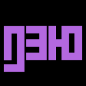
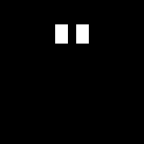

# pmcp_keytop

8 × 4 = 32 キーの [Stream Deck XL](https://www.elgato.com/us/en/p/stream-deck-xl) で東島通商語のカスタムキーボードを作るためのもろもろ。

現状 [CUTAPIJOT フォント](https://github.com/yasusho/qafopwa_pmcp_font?tab=readme-ov-file#cutapijot)でキートップを作っている。

# キーボードの概要

## 通常モード

### 画像

|  |  |  |  |  |  |  |  |
|:---:|:--:|:--:|:--:|:---:|:--:|:--:|:--:|
|  |  |  |  |  |  |  |  |
|  |  |  |  |  |  |  |  |
|  |  |  |  |  |  |  |  |

### 転写

| XON | <code>P</code> | <code>B</code> | <code>M</code> | <code>C</code> | <code>X</code> | <code>Z</code> | LAIJU E LUCUC |
|:--:|:--:|:--:|:--:|:--:|:--:|:--:|:--:|
| <code> </code> | <code>T</code>|<code>D</code>|<code>N</code>|<code>L</code>|<code>K</code>|<code>A</code>|  <code> </code> |
| <code> </code> | <code>E</code>|<code>I</code>|<code>U</code>|<code>O</code>|<code>J</code>|<code>W</code>| <code> </code> |
| <code>(</code>|<code>.</code>|<code>,</code>|<code>?</code>|<code>!</code>|<code>-</code>|<code>"</code>|<code>)</code>|

### 解説

- 東島通商語で通常使う字母（アルファベット）は 18 字なので、それを向こうのアルファベット順に 6 × 3 に並べたものを基本的な配列とする。
- 「東島通商語入門」で定義されているパンクチュエーション 6 種（文末、文継続、疑問、感嘆、語連結、引用）を、掲載順にそのまま載せた 6 × 4 配列を内部に含んでいる。
- フォントによってはサポートされていないカッコを左右に配置。
- 端の空白は、空白キー。左手でも右手でも空白が打てて便利。
- LAIJU E LUCUC「行が終わる」は、改行キー。実装上は Stream Deck の「メッセージの後に "Enter" キーを押す」モードをオンにして空文字列を打っている。
- XON「妙」キーは、押すとキートップが「妙モード」になる。実装上は Stream Deck の「ページ移動」で実現。

## 妙モード

### 画像

|  |  |  |  |  |  |  |  |
|:---:|:--:|:--:|:--:|:---:|:--:|:--:|:--:|
|  |  |  |   |   |  |   |   | 
|  |  |  |   |   |   |    |   |
|  |  |  |  |  | |  | | 

### 転写

| PAPEL | <code>S</code> | <code>G</code> | <code>H</code> | <code>/</code> | DIJAC | ↼NIP | NIP⇀ |
|:---:|:--:|:--:|:--:|:---:|:--:|:--:|:--:|
| <code>0</code> | <code>1</code> | <code>2</code> |  <code>3</code> |  <code>4</code> |  |  ↾ |   | 
| <code>5</code> | <code>6</code> | <code>7</code> |  <code>8</code> |  <code>9</code> |  ↼ |  ET  |  ⇀ |
| PENUL | DUTUCUN | AUC | LET | AMOL | | ⇂ | | 

- 通常の東島通商語では使わず他言語の音を頑張って表すときに使う `S`（ザ行）・`G`（ガ行）・`H`（ハ行） を配置。
- 数字を配置。横棒が増えると 5 増える表記体系であるため、5 × 2 で配置。
- PAPEL「通常」キーは、押すとキートップが「通常モード」になる。実装上は Stream Deck の「ページ移動」で実現。
- DIJAC「取り消す」キーは、Esc キーにマッピング。
- NIP「消す」キーは削除。
  - 「↼NIP」は、左を消すキーである BackSpace キーにマッピング
  - 「NIP⇀」は、右を消すキーである Delete キーにマッピング
- 矢印キーはそのまま矢印キーであり、カーソル移動を表す。
- ↼PENUL「古い」は Ctrl+Z にマッピングさせているが、Alt + ↼ にする手もあったかもしれない。
- DUTUCUN⇀「新しい」は Ctrl+Y にマッピング。
- AUC「全て」は Ctrl+A にマッピング。
- LET「持つ」は Ctrl+C にマッピング。選択したところを手に取るイメージ。
- AMOL「置く」は Ctrl+V にマッピング。
- ET「ほか」は、その他のいろんなことができるコンテクストメニューに対応付けているが、Stream Deck は右クリックに対応していなかったので、Shift+F10 でコンテクストメニューを呼び出す実装とした。
